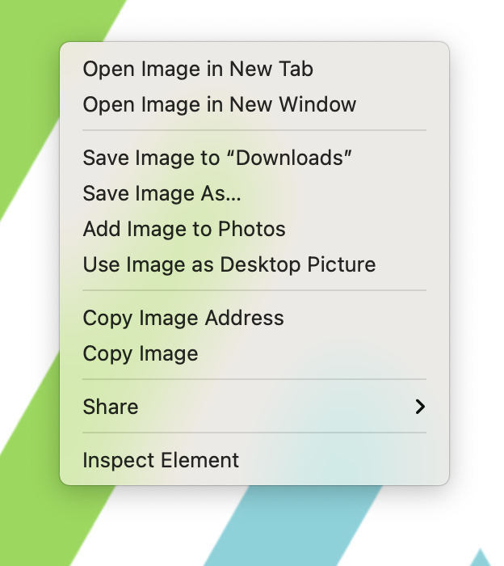

Scroll down to find various logos and images.

Use JPGs for emails.

Use PNGs and SVGs for websites, marketing material, etc.

## How to get the url for images

1. Select an image. (usually JPG is the safe format)
2. Right click on image and **Copy Image Address**
   
3. Paste that into the `src=""` tag of your html email. Example: ``
4. UYou can also **Save Image As** and use a [base64 encoder](https://www.base64encoder.io/image-to-base64-converter/) to embed into emails rather than link.

---

